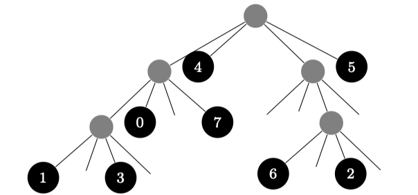
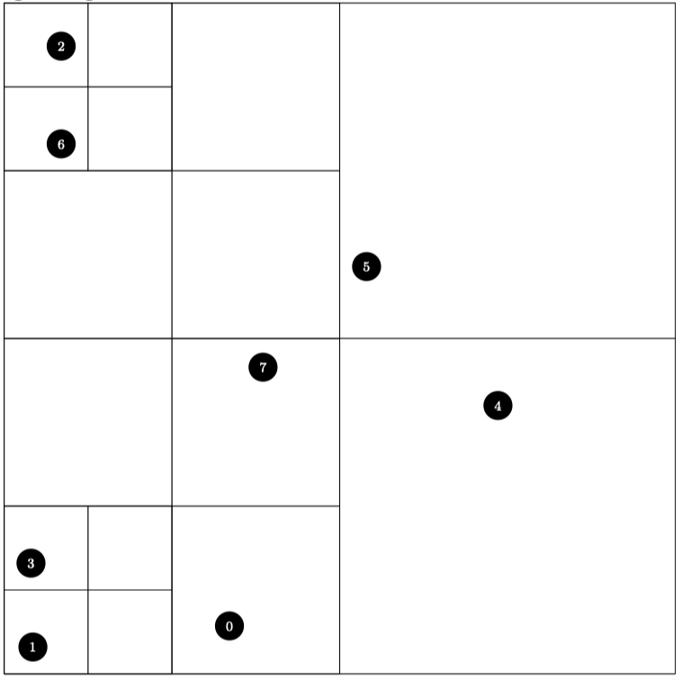

# forestTex4tree

**Either:**
 
* parse **.tex* file containing a quadtree in the bracket notation used by the forest package and create a 2 dimensional representation of it as a tikz picture
* **or** parse a **.h5* file containing particle position and create a tree plot and a 2 dimensional representation of it, both as a tikz picture

## Usage

* create tree representation **.tex*

<details>
  <summary>Sample input file</summary>

e.g.:

```
\begin{forest}
  for tree = {circle, fill=black, text=white, node options={minimum width = 3ex}, font=\footnotesize}
  [,fill=gray
    [,fill=gray
      [1,minimum width=4ex][2,minimum width=4ex][,fill=white][3,minimum width=4ex]
    ]
    [,fill=gray
      [,fill=gray
        [,fill=white][4,minimum width=4ex][,fill=white][,fill=white]
      ]
      [,fill=gray
        [,fill=white][5,minimum width=4ex][6,minimum width=4ex][,fill=white]
      ]
      [,fill=white]
      [,fill=gray
        [,fill=white][,fill=gray
          [,fill=white][7,minimum width=4ex][,fill=white][8,minimum width=4ex]
        ][,fill=white][,fill=white]
      ]
    ]
    [,fill=white]
    [,fill=gray
      [,fill=white][9,minimum width=4ex]
      [,fill=gray
        [10,minimum width=4ex][,fill=white][11,minimum width=4ex][12,minimum width=4ex]
      ]
      [,fill=white]
    ]
  ]
\end{forest}
```
</details>

* or create particle representation **.h5*
	*  e.g.: using [createParticleH5.py](createParticleH5.py)
* **Compile** using *Makefile* via `make`
* **Run** via `./bin/forest2tikz <options>`

```
-f, --file arg  Path to input file
-t, --tree arg  Path to output file for tree plot (default: tree.tex)
-b, --box arg   Path to output file for box plot (default: boxes.tex)
-h, --help      Show this help
```
* include file (content) in tex document

> Note: 
> 
> * providing a *.tex input file, generates a box plot
> * providing a *.h5 input file, generates a tree and a box plot

### Example

* `python createParticleH5.py` creates *particles.h5*
* `./bin/forest2tik -f particles.h` creates
	* *tree.tex*
	* *boxes.tex*
* include into tex file

<details>
  <summary>Tex sample</summary>

```
\begin{forest}
for tree = {circle, fill=black, text=white, node options={minimum width = 3ex}, font=\footnotesize}
[,fill=gray
[,fill=gray
[,fill=gray
[1,minimum width=4ex][,fill=white][3,minimum width=4ex][,fill=white]
][0,minimum width=4ex][,fill=white][7,minimum width=4ex]
][4,minimum width=4ex][,fill=gray
[,fill=white][,fill=white][,fill=gray
[6,minimum width=4ex][,fill=white][2,minimum width=4ex][,fill=white]
][,fill=white]
][5,minimum width=4ex]
]\end{forest}


\begin{tikzpicture}
\tikzset{particle/.style={minimum width=4ex, circle, fill=black, text=white, font=\footnotesize}}
    \draw (0, 0) rectangle (14, 14);
    \draw (0, 0) rectangle (7, 7);
    \draw (0, 0) rectangle (3.5, 3.5);
    \draw (0, 0) rectangle (1.75, 1.75);
    \draw (1.75, 0) rectangle (3.5, 1.75);
    \draw (0, 1.75) rectangle (1.75, 3.5);
    \draw (1.75, 1.75) rectangle (3.5, 3.5);
    \draw (3.5, 0) rectangle (7, 3.5);
    \draw (0, 3.5) rectangle (3.5, 7);
    \draw (3.5, 3.5) rectangle (7, 7);
    \draw (7, 0) rectangle (14, 7);
    \draw (0, 7) rectangle (7, 14);
    \draw (0, 7) rectangle (3.5, 10.5);
    \draw (3.5, 7) rectangle (7, 10.5);
    \draw (0, 10.5) rectangle (3.5, 14);
    \draw (0, 10.5) rectangle (1.75, 12.25);
    \draw (1.75, 10.5) rectangle (3.5, 12.25);
    \draw (0, 12.25) rectangle (1.75, 14);
    \draw (1.75, 12.25) rectangle (3.5, 14);
    \draw (3.5, 10.5) rectangle (7, 14);
    \draw (7, 7) rectangle (14, 14);
    \node[particle] at (0.6, 0.56) {1};
    \node[particle] at (0.56, 2.31) {3};
    \node[particle] at (4.7, 1) {0};
    \node[particle] at (5.4, 6.4) {7};
    \node[particle] at (10.3, 5.6) {4};
    \node[particle] at (1.19, 11.06) {6};
    \node[particle] at (1.19, 13.1) {2};
    \node[particle] at (7.56, 8.5) {5};
\end{tikzpicture}
```
</details>

gives: 





 


